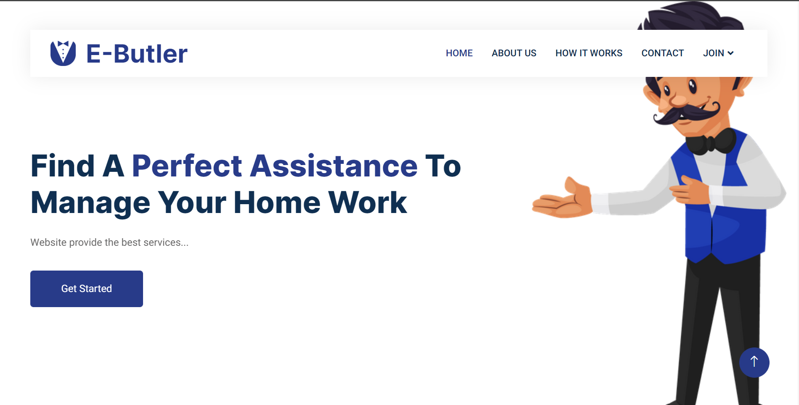
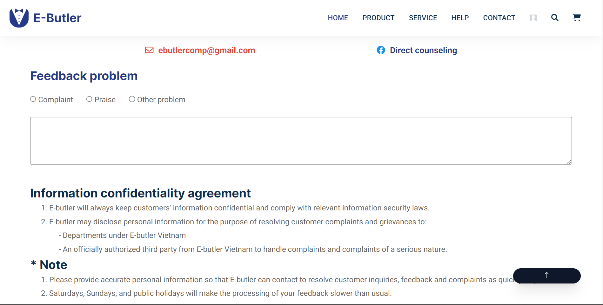
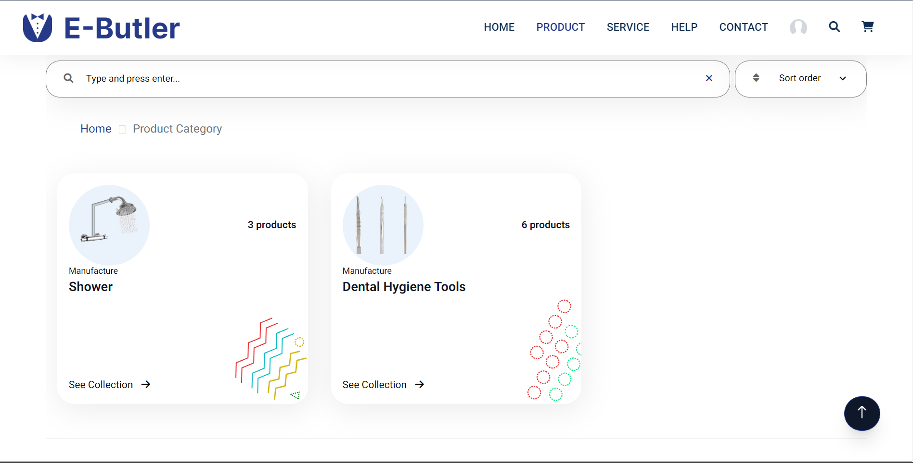
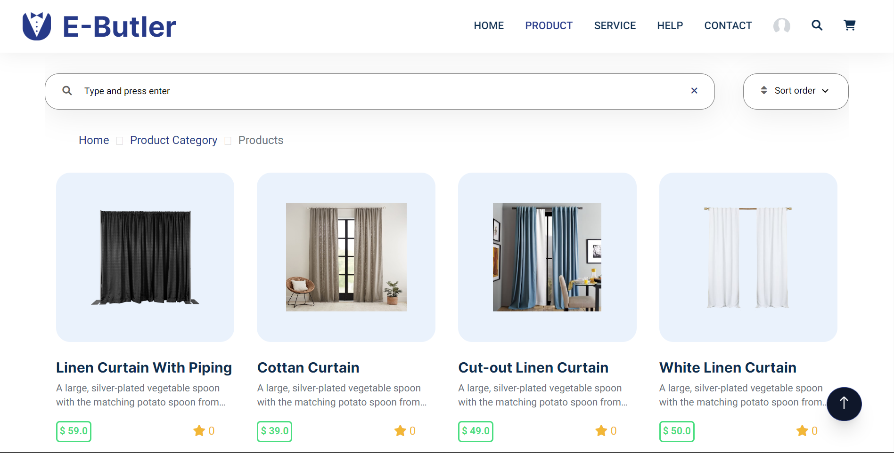
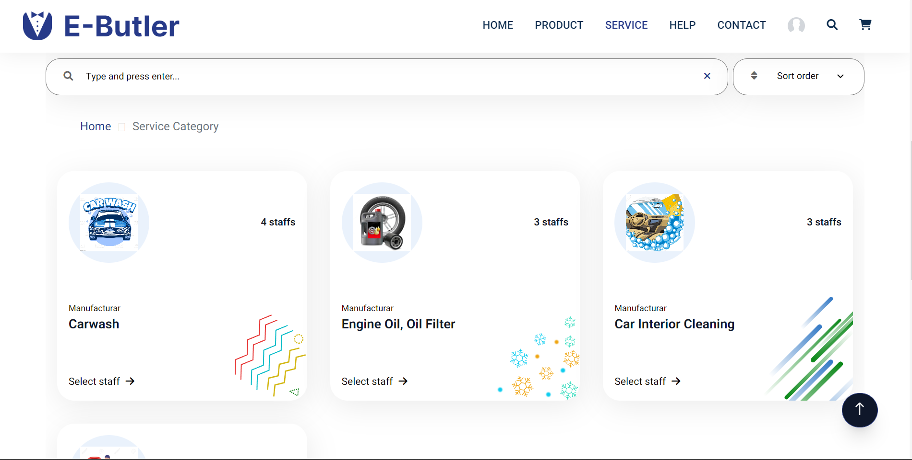
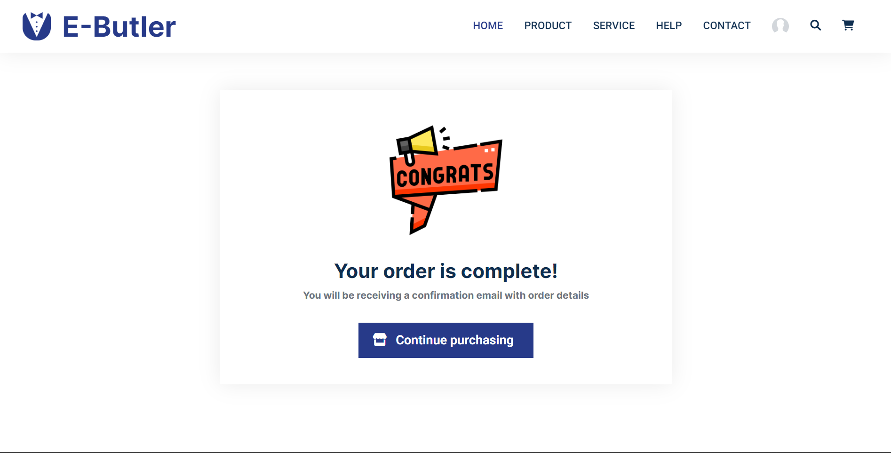
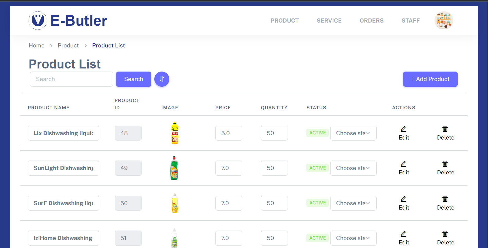
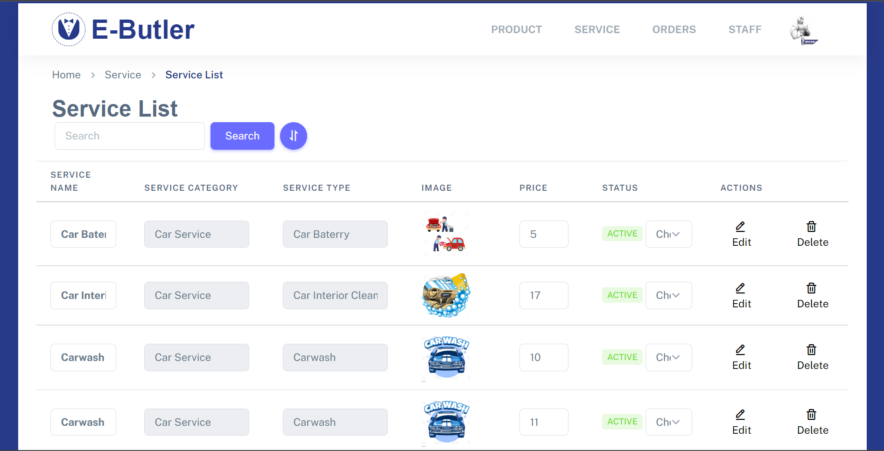
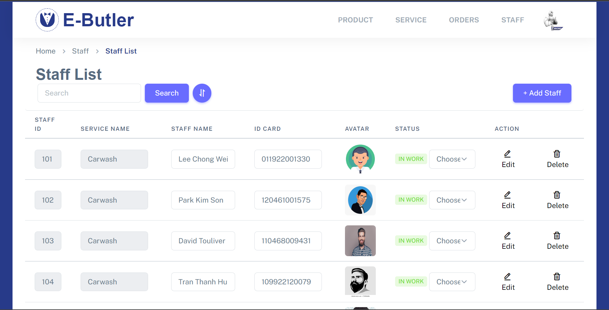

## Ebutler-Web-Application-Project | Done (10/09/2022 - 15/11/2022 ) ☺😉
### Description
- This is the project of SWP291 subject - which is about the virtual butler website. Customers can visit to buy product(food, clothes) or book services(cleaning, car washing, decorating).
### Preview Screenshot

  </img> &nbsp;&nbsp; </img>
  </img> &nbsp;&nbsp; </img>
  </img> &nbsp;&nbsp; </img>
  </img> &nbsp;&nbsp; </img> 
  </img> &nbsp;&nbsp; </img>

### Technologies
**1. Frontend**
  - HTML, CSS, JavaScript
  - Boostrap Framework

**2. Backend**
  - Java Language

**3. Database**
  - Microsoft SQL Server 

**4. Other Technologies**
- Oauth2
- MVC2 Model
- PayPal Integration

**5. Tool**
  - Netbeans 15
  - Java JDK 1.8
  - Apache Tomcat 8.5.83
  - Jira

## License & Copyright
&copy; 2022 K
